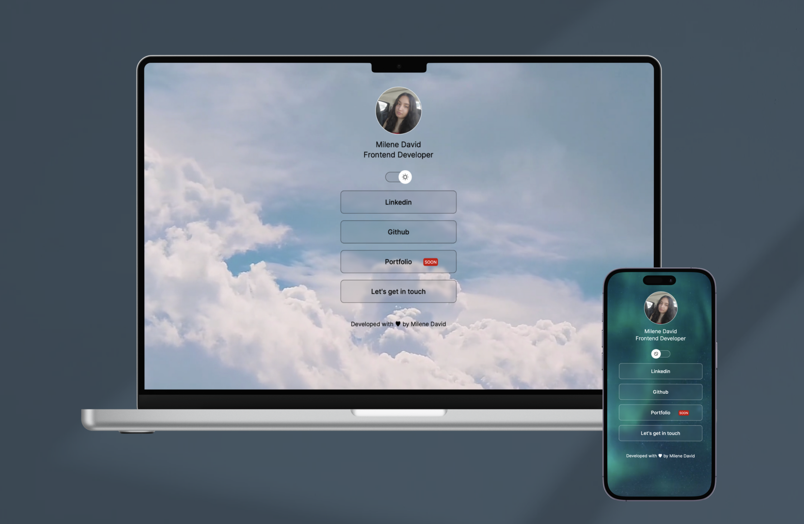

<h1 align="center"> DevLinks </h1>

Project carried out  during the Discovery course promoted by Rocketseat to teach  Web technologies  

            

  <a href="#-technologies">Technologies</a>&nbsp;&nbsp;&nbsp;|&nbsp;&nbsp;&nbsp;
  <a href="#-projeto">Project</a>&nbsp;&nbsp;&nbsp;|&nbsp;&nbsp;&nbsp;
  <a href="#-layout">Layout</a>&nbsp;&nbsp;&nbsp;|&nbsp;&nbsp;&nbsp;
  <a href="#-license">License</a>

  

 

  

## 🚀 Technologies

This project was developed with the following technologies: 
- HTML and CSS
- JavaScript
- Git and Github
- Figma

## 💻 Project

Devlinks is a link aggregator to use as an online business card

- [Access the finished project, online](https://milenedavid-devlinks.vercel.app/)

## 🔖 Layout

You can view the project layout through [this link](https://www.figma.com/community/file/1187422022288947321). You need to have a [Figma](https://figma.com) account to access it. 

## 📝 License

This project is licensed under the MIT license
